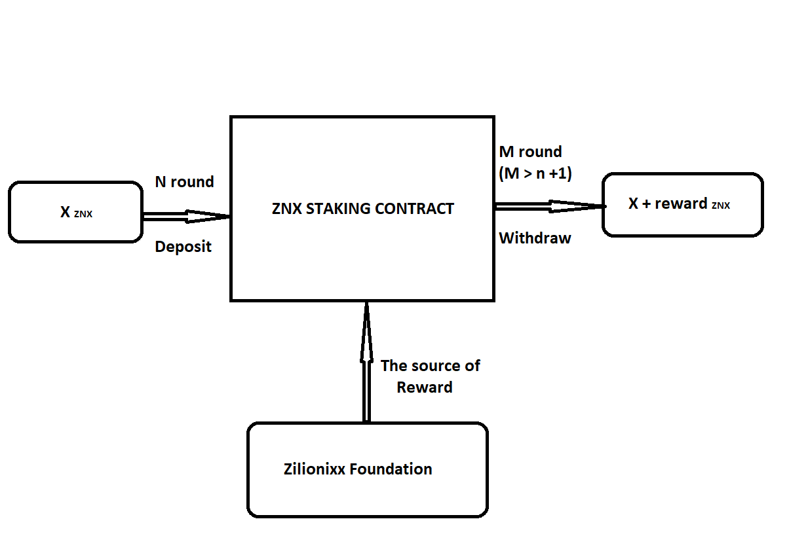

# Smart contract for staking ZNX and get rewards

Staking and getting a reward contract for ZNX coin.

## Motivation

The purpose for this contract is to get automatic rewards by staking ZNX coins so that early owners can benefit from that. The source of reward is provided by Zilionixx foundation and afforded with smart contract deployment. Nobody, even the owner, can not withdraw that reward.

## How staking program works

This staking-and-get-reward program consists of rounds. Each round has the same amount of reward (i.e; 100 ZNX). This reward will be distributed to those who staked their ZNX to the contract. Your reward portion will be determined by how much you staked in the round.

Your round reward = Your round stake \* Round reward / Total round stake

You can only get a reward when you staked your coins during a full round. This means that your staking during round 1 will not be calculated for this round reward. This also means your staking makes effects only after 2 rounds. So staking before the staking program takes effect after round2 starts and staking in round 1 will reward after round3 starts. This staking program will be started by a smart contract owner. After each round ends, the owner makes a transaction to trigger the next round. If you want to take part in this staking and get rewards, buy ZNX and simply stake your coin on the staking page.

